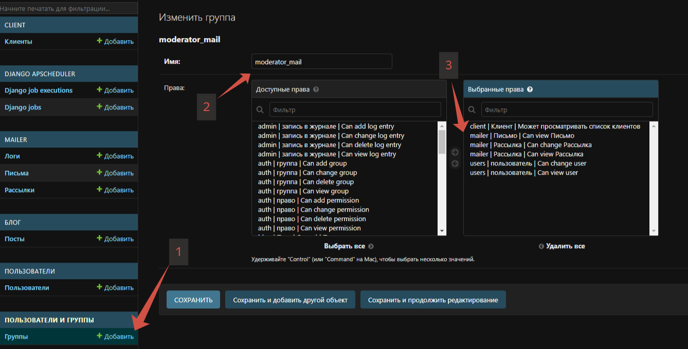

### Для запуска необходимо:

- Перейти в папку в которой будем работать
-
    - path_to_dir ваша рабочая директория
``` PowerShell
cd path_to_dir
```
- Склонировать репозиторий
``` PowerShell
git clone https://github.com/Nudlik/mailer_service.git
```
- Cоздать виртуальное окружение
``` PowerShell
- python -m venv venv
```
- Активировать виртуальное окружение
``` PowerShell
.\venv\Scripts\activate
```
- Установить зависимости
``` PowerShell
pip install -r requirements.txt
```
- Прописать в .env ваши настройки(пример файла .env.example):
- Приминить миграции
``` PowerShell
python .\manage.py migrate
```
- Для старта redis кеша в .env прописываем CACHES_ENABLED=True заходим в wsl
``` PowerShell
sudo service redis-server start
```
- Запустить программу/запустить программу из среды разработки
``` PowerShell
python .\manage.py runserver
```
- Запуск ежедневной периодической рассылки
``` PowerShell
python .\manage.py runapscheduler
```
- Для запуска скрипта рассылки из консоли(тестовый)
``` PowerShell
python .\manage.py start_send_mail
```

### Для настройки прав модератора

- Заходим в админку
- Смотрим на скрин выставляем права и можно выдавать модерку

### Сервис почтовой рассылки

##### Система содержит:

- Интерфейсы: CRUD рассылок/клиентов/писем, отчет проведенных рассылок(логи)
- Настроенный интерфейс для модератора
- Скрипт рассылки, который работает как из командой строки, так и по расписанию
- Настройки конфигурации для периодического запуска задачи
- Настроена корректная обработка ошибок и сбор статистики по каждому сообщению для последующего формирования отчетов

##### Логика работы системы:
- Авторизованный в системе пользователь может создать рассылку, содержащую его сообщение и предназначенную его клиентам (получателям).
- Пользователь может отслеживать процесс, отредактировать параметры рассылки или завершить её раньше срока.
- Пользователь не может видеть рассылки, сообщения и клиентов других пользователей системы.
- После создания новой рассылки, если текущее время больше времени начала (последней рассылки) и меньше времени окончания, 
то система выбирает из справочника всех клиентов, которые указаны в настройках рассылки, и запускается отправка один раз в день.
- Если создается рассылка со временем старта в будущем, то отправка стартует автоматически по наступлению этого времени без дополнительных действий со стороны пользователя системы.
- По ходу отправки сообщений собирается статистика (Logs) по каждой рассылке.
- Модератор может просматривать список пользователей сайта/писем/настроек рассылки для модерации, может отключить рассылку, а также заблокировать пользователя.
- Для продвижения сервиса создан Блог

